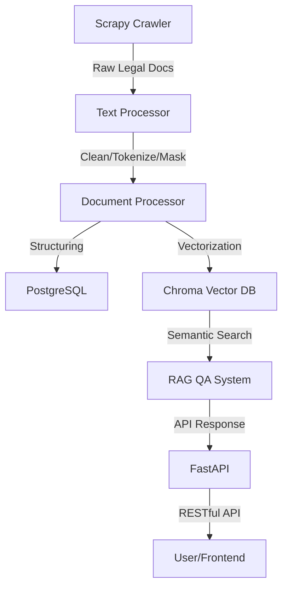

# Legal Document Intelligence Platform

A modern platform for crawling, processing, storing, and analyzing Taiwan legal documents (e.g., court decisions, regulations), featuring vector search, RAG QA, and RESTful API.

## Tech Stack
- Python 3.10+
- Scrapy
- Pandas
- SQLAlchemy + PostgreSQL
- ChromaDB + sentence-transformers
- FastAPI
- Docker, docker-compose
- Poetry, pytest, ruff

## Installation & Quick Start
```bash
# 1. Clone the repo
$ git clone https://github.com/yourusername/legal-doc-intelligence.git
$ cd legal-doc-intelligence

# 2. Install dependencies
$ poetry install

# 3. Start services (recommended: Docker Compose)
$ docker-compose up --build

# 4. API docs: http://localhost:8000/docs
```

## Architecture



## API Example

### Upload Document
```http
POST /api/v1/documents
Content-Type: multipart/form-data

file=@test.docx
```
**Response:**
```json
{
  "filename": "test.docx",
  "status": "uploaded"
}
```

### Legal QA
```http
POST /api/v1/question
Content-Type: application/json

{
  "question": "What is Article 359 of the Civil Code?"
}
```
**Response:**
```json
{
  "question": "What is Article 359 of the Civil Code?",
  "answer": "(mock answer)"
}
```

### Document Analysis
```http
POST /api/v1/analyze
Content-Type: application/json

{
  "doc_id": 123
}
```
**Response:**
```json
{
  "doc_id": 123,
  "analysis": "(mock analysis)"
}
```

## Contribution
See [CONTRIBUTING.md](CONTRIBUTING.md)

## License
MIT 