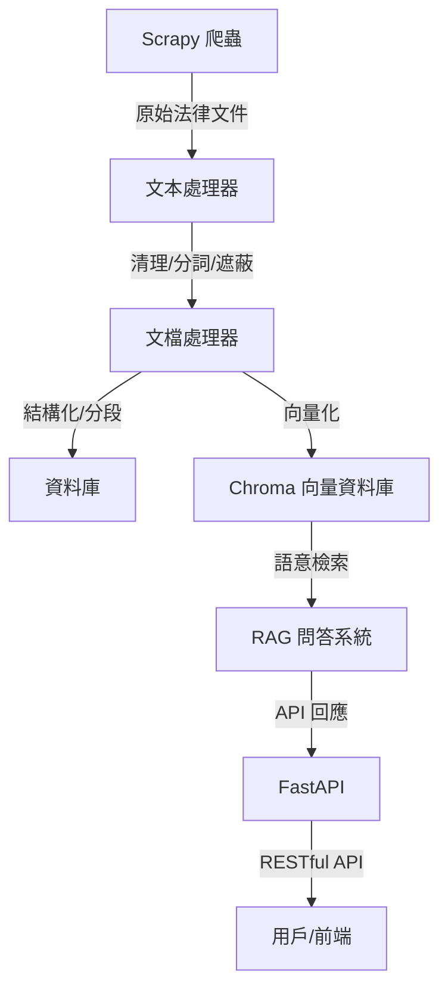

# Legal Document Intelligence Platform

[](https://github.com/MJS-Ermine/legal-doc-intelligence/actions/workflows/ci.yml)
[](https://codecov.io/gh/MJS-Ermine/legal-doc-intelligence)

法律文件智能處理平台，支援台灣法律文件（如司法院判決書、法規）的大量爬取、清洗、資料庫存儲、向量化、RAG 問答與 API 服務。

## 技術棧
- Python 3.10+
- Scrapy
- Pandas
- SQLAlchemy + PostgreSQL
- ChromaDB + sentence-transformers
- FastAPI
- Docker, docker-compose
- Poetry, pytest, ruff

## 安裝與啟動
```bash
# 1. 下載專案
$ git clone https://github.com/你的帳號/legal-doc-intelligence.git
$ cd legal-doc-intelligence

# 2. 安裝依賴
$ poetry install

# 3. 啟動服務（建議用 Docker Compose）
$ docker-compose up --build

# 4. 進入 API 文件
# http://localhost:8000/docs
```

## 目錄結構
```plaintext
src/legal_doc_intelligence/
├── scrapers/
│   └── spiders/
├── processors/
├── database/
├── vectorstore/
├── api/
├── utils/
tests/
config/
data/
logs/
```

## 主要功能
- 法律文件爬蟲（Scrapy）
- 文本清理、結構化、個資遮蔽
- PostgreSQL 資料庫存儲
- 向量資料庫與語意檢索（ChromaDB）
- RAG 問答系統
- FastAPI RESTful API
- Docker 化部署
- 單元測試與 CI/CD

## 開發指南
- 請參考 CONTRIBUTING.md
- 使用 Poetry 管理依賴
- 使用 pytest 撰寫與執行測試
- 使用 ruff 檢查程式風格

## 注意事項
- 請勿將大型資料檔案、日誌、敏感資訊 commit 進倉庫
- 請善用 .gitignore

## 貢獻指南
歡迎 PR、issue 與建議！詳見 CONTRIBUTING.md

## 功能特點

- 文件處理和分析
- 向量化存儲（使用 FAISS）
- 智能問答系統（基於 RAG）
- REST API 接口

## 快速開始

### 安裝

```bash
# 克隆專案
git clone https://github.com/MJS-Ermine/legal-doc-intelligence.git
cd legal-doc-intelligence

# 創建虛擬環境
python -m venv venv
source venv/bin/activate  # Linux/Mac
# 或
.\venv\Scripts\activate  # Windows

# 安裝依賴
pip install -r requirements.txt
```

### 運行

```bash
# 運行 API 服務
uvicorn legal_doc_intelligence.api.main:app --reload
```

訪問 http://localhost:8000/docs 查看 API 文檔。

## 開發

### 測試

```bash
# 運行測試
pytest

# 運行測試並生成覆蓋率報告
pytest --cov=legal_doc_intelligence --cov-report=html
```

### 代碼品質

```bash
# 運行代碼檢查
ruff check .
```

## API 文檔

主要 API 端點：

- `POST /api/v1/documents`: 上傳和處理文件
- `POST /api/v1/question`: 提交法律問題
- `POST /api/v1/analyze`: 分析文件

詳細 API 文檔請參考 Swagger UI：http://localhost:8000/docs

## 授權

本專案採用 MIT 授權協議。

## 架構圖



## API 請求/回應範例

### 上傳文件
```http
POST /api/v1/documents
Content-Type: multipart/form-data

file=@test.docx
```
**回應：**
```json
{
  "filename": "test.docx",
  "status": "uploaded"
}
```

### 法律問答
```http
POST /api/v1/question
Content-Type: application/json

{
  "question": "什麼是民法第359條？"
}
```
**回應：**
```json
{
  "question": "什麼是民法第359條？",
  "answer": "(mock answer)"
}
```

### 文檔分析
```http
POST /api/v1/analyze
Content-Type: application/json

{
  "doc_id": 123
}
```
**回應：**
```json
{
  "doc_id": 123,
  "analysis": "(mock analysis)"
}
```

---

[English README](README.en.md)
