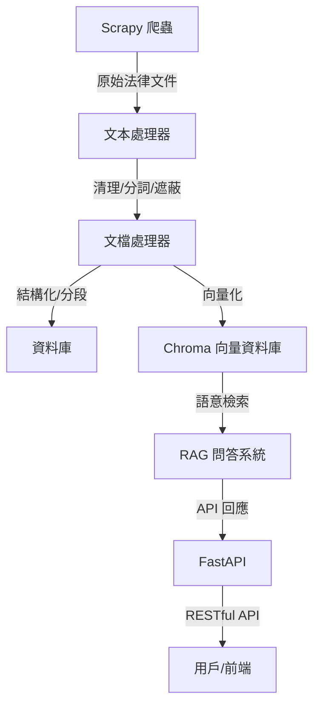

# Legal Document Intelligence Platform 架構圖

## 架構說明
- **Scrapy 爬蟲**：負責自動化抓取台灣法律文件。
- **文本處理器**：進行 HTML 清理、分詞、個資遮蔽。
- **文檔處理器**：結構化、分段、metadata 提取，並與向量資料庫整合。
- **資料庫**：PostgreSQL 儲存原始與結構化文件。
- **Chroma 向量資料庫**：儲存語意向量，支援高效語意檢索。
- **RAG 問答系統**：結合語意檢索與 LLM，提供智能問答。
- **FastAPI**：RESTful API 入口，串接前端或第三方應用。 